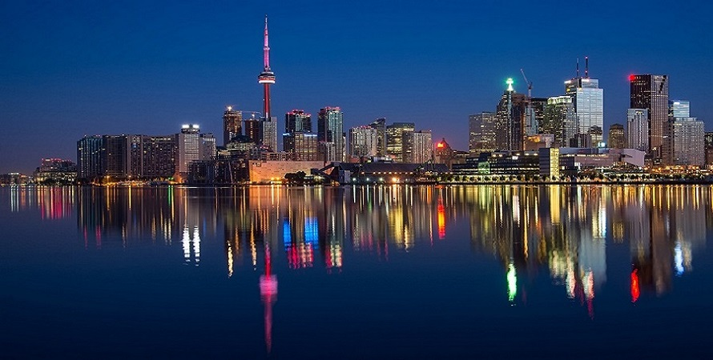

<!doctype html>
<html>

<head>
<meta charset="UTF-8">
 <title>Love grue</title>
<link rel="stylesheet" type="text/css" href="indexxx.css">
  <link rel="stylesheet" href="https://stackpath.bootstrapcdn.com/font-awesome/4.7.0/css/font-awesome.min.css">
</head>

<body>

	

<ul>
<li class="active"><i class="fa fa-home" aria-hidden="true"></i><a href="#">Home</a></li>

<li><a href="#"><i class="fa fa-heart" aria-hidden="true"></i>About Us</a>

<ul>
<li><a href="#">Love Topic<i class="fa fa-heart"></i></a></li>
<li><a href="#">thoury</a></li>
<li><a href="#">Trick</a></li>
</ul>

</li>

<li><a href="#"><i class="fa fa-cogs" aria-hidden="true"></i>Services</a>

<ul>
<li><a href="#">Love SmS</a></li>
<li><a href="#">Miss SmS</a></li>
<li><a href="#">Breack SmS</a></li>
<li><a href="#">Broken SmS</a></li>
<li><a href="#">Crazy SmS</a></li>

</ul>

</li>
<li><a href="#"><i class="fa fa-user" aria-hidden="true"></i>Clients</a>

<ul>

<li class="hover-me"><a href="#">Owner<i class="fa fa-angle-right"></i></a></li>

<ul><a href="#">Md Easin Rx2</li>
</li>
</ul>

<li><a href="#">Admin<i class="fa fa-angle-right"></i></a></li>
<li><a href="#">User<i class="fa fa-angle-right"></i></a></li>

</ul>

</li>
<li><a href="#"><i class="fa fa-plug" aria-hidden="true"></i>Trips</a>

<ul>

<li><a href="#">Love Quotes</a></li>
<li><a href="#">Kiss Quotes</a></li>
<li><a href="#">Miss Quotes</a></li>

</ul>

</li>
<li><a href="#"><i class="fa fa-comments" aria-hidden="true"></i>Contract</a>

<ul>

<li><a href="#">Massege</a></li>
<li><a href="https://mdeasinarafatrana@gmail.com">E-mail</a></li>
<li><a href="#"> Web Massege</a></li>

</ul>

</ul>

<h1>

<h1 align="center"> 
<b><i><u>Love Grue
</b></i></u></h1>

  

<h1>
<marquee>
কারো জন্য বুকের মধ্যে শূন্যতা অনুভব করার নাম ভালবাসা " .
"কারো সাথে পাশাপাশি চলার তীব্র ইচ্ছার নাম ভালবাসা " .
"কারো সাথে কথা বলতে না পেরে ছটফট করার নাম ভালবাসা " .
"কাউকে নিয়ে ভাবতে ভাল লাগার নাম ভালবাসা " .
"কাউকে সুখী দেখে নিজেকে সুখী ভাবার নাম ভালবাসা " .
"কারো চোখের কোনে দু ফোটা জ্বল দেখে কেঁদে ফেলার নাম ভালবাসা " . .
"কারো কাছ থেকে কিছু পাবো না ভেবেও কিছু পাওয়ার আশা করার নাম ভালবাসা " । 
</marquee> 

<a href="http://www.facebook.com/md.easinarafatrana"> Love Grue</a> Facebook page.

<a href="http:www.YouTube.com"> Love Tips</a>YouTube Page
 

<h2>
<u><b><i>Love Quotes</i></b></u>
</h2>

<h4>
দুটি মানুষের দুটি দিল  তার মধ্যে কতো মিল  দুটি মনের দুটি আসায়  এক হয়েছে ভালোবাসায় 

</h4>

<h2 align="center">
<b><u><i>একগুচ্ছ কদম</u></i> </h2>
বেলকনির কোণ ঘেঁষে শরীর এলিয়ে দিয়ে মাথা ঠেকিয়ে দাঁড়ালো রিদিতা । বুক ভরা চাপা কষ্ট তার । আর কাউকে কাছে না পাওয়ার আর্তনাদ।ছটফটে মনে তাকে বারবার মনে করা । চোখের কোণে কালো দাগ স্পষ্ট।আধ ভেজা ঠোটটাতে মনের আবেশে গান গেয়ে চলেছে সে !
তুমি যাকে ভালোবাসো,
স্নানের ঘরে বাস্পে ভাসো,
তার জীবনে ঝড়।
তোমার কথার শব্দ দূষণ,
তোমার গলার স্বর।
আমার দরজায় খিল দিয়েছি,
আমার দারুন জ্বর।
তুমি অন্য কারোর সঙ্গে বেঁধো ঘর,
তুমি অন্য কারোর সঙ্গে বেঁধো ঘর।
তোমার নৌকোর মুখোমুখি আমার সৈন্যদল
বাঁচার লড়াই,
আমার মন্ত্রী খোয়া গেছে একটা চালের ভুল
কোথায় দাঁড়াই।
কথার ওপর কেবল কথা,
সিলিং ছুতে চায়।
আমি : ঠিক আছি আমি তোরা চিন্তা করছিস কেন। এখন চল ভেতরে যাই !
ক্লাসে যেতে যেতে মনে হলো কেউ একজন পিছনে কিন্তু পিছন ফিরে তাকাতেই কাউকে দেখতে পেলাম না হয়তো আমারই মনের ভুল।
আর এদিকে কেউ একজন বলতে লাগলো ‘তুমি যে আর ঠিক থাকবে না আমার কদম ফুল’ ( বলেই শয়তানি হাসি দিলো )
ক্লাসরুমে আসতে দেখলাম সবাই গল্পে ব্যস্ত। ভিতরে গিয়ে বসতেই মোহো বলে বসলো !
মোহো : কার জন্য কেঁদেছিলি ? তোর চোখমুখের এই অবস্থা কেন তুই এখনো কান্দিস ওই কুত্তার জন্য ! কি কথা বলিস না কেন কথা বল।
জান্নাত : মোহো চুপ কর ওকে কিছুদিন সময় দে ও স্বাভাবিক হোক ।- একগুচ্ছ কদম
সাজি : হ্যাঁ মোহো‌ ওকে সময় দে আর আমরা তো আছিই তাই না।
মোহো : শোন রিদি “একটা সময় আসবে যখন তুই বুঝতে পারবি এই জীবনে যারা তোকে ফেলে চলে গেছে তারা চলে যাওয়াতেই তোর মঙ্গল হয়েছে”
আমি : তোরা চুপ ক….( বলতে বলতেই স্যার চলে আসলো আর তার দিকে তাকিয়ে যেন আমার দুনিয়া ঘুরে গেল দাঁড়িয়ে গেলাম আমি আর মুখ দিয়ে একটা কথাই বের হলো “রিদানশ”

</b>

<h2 align="center"><u><b>মেঘকন্যা<b></u></h2>

আজকে খুব ভাল লাগছে আমার।কারন আমি জীবনেওট্রেনে ভ্রমন করিনি আজ করব।আমাদের বাসা কুমিল্লা আর ট্রেনে করে বেড়াতে যাবো আমার খালার বাসায়উনার বাসা সিলেট।উনার বাসায় আরো অনেক বারই যাওয়া হইছে বাসে করে কিন্তু ট্রেনে করে এই প্রথম যাওয়া।আবার সিলেট শহর টা অনেক সুন্দর একটা শহর। অনেক দিন পরে খালার বাসায় যাচ্ছি তাই আজকে মনের মধ্যে অজানা এক উৎফুল্ল ও ভাললাগা কাজ করছে।
.
কুমিল্লা ট্রেন স্টেশনে গিয়ে একটা টিকেট কেটে বসে আছি। দশমিনিট পরে ট্রেন আসবে।দেখতে দেখতে ট্রেন এসে গেল।আমি আমার ব্যাগ টা নিয়ে ট্রেনের মধ্যে আমার সিট খুঁজে বসে পড়লাম।আমার ভাগ্য মনে হয় ভালই ছিল। আমি যে ট্রেনে জানালার পাশে সিট পেয়েছি।একটু পরে একটা মেয়ে এসে পাশে বসল।মেয়েটা অনেক সুন্দরি ছিল।
.
ট্রেন ছেড়ে দিয়েছে ট্রেনের গতির সাথে সাথে গাছ-পালা গুলোও দুরে চলে যাচ্ছে।মাঝে মাঝে রেললাইনের
পাশের বাড়ির সামনে ছোট ছোট বাচ্চাদের হৈ চৈ দেখতে পেলাম হয়ত ট্রেন দেখে ওরাও আনন্দ পাচ্ছে।এই সব আনন্দঘন দৃশ্য গুলো দেখে অজান্তেই মনের মধ্যে অন্যরকম শিহরন বয়ে যেতে লাগল।
.
--এই ছেলে একটা কথা ছিল।
--হুম বলেন।
--কিছু মনে করবের না তো।
--না বলেন।
--আমাকে এই জানালার পাশের সিটে বসতে দিন।
--বললেই হল।এটা আমার সিট আমিই বসব।
--কই দেখি দেখি।সিটে আপনার নাম আছে নাকি।
--সিটে নাম থাকবে কেন।
--এখনি তো বললেন এটা আপনার সিট।আপনার সিট হলে তো নাম থাকবেই।
--টিকেট কেটেছি আমি এই সিটের জন্য এবার বুঝেছেন।
--হুম।বুঝলাম।দেখি টিকেটটা।
--এই যে দেখেন সিট নাম্বার।
.
বলতেই টিকেটটা ছু মেরে হাত থেকে কেড়ে নিল মেয়েটা।
.
--এবার কি হবে মিস্টার।
--আরে আরে আপনি আমার টিকেট নিলেন কেন।
--টিকেট নিয়েছি আপনাকে পুলিশে ধরিয়ে দিব।বলব আপনি বিনা টিকিটে ট্রেনে চরেছেন।
--প্লিজ এমনটি করবেন না।
--ঠিক আছে করবনা।আপনার সিটে আমাকে বসতে দিন টিকিট ফিরিয়ে দিব।
--ওকে।বসেন।
.
এই বলে আমি মেয়েটাকে আমার প্রিয় জানালার সিট ছেড়ে দিলাম আর মেয়েটা টিকেট টা দিল।মনে মনে
ভাবছি কি সাংঘাতিক মেয়েরে বাবা পুরাই ছিনতাই কারিদের মত স্বভাব।যাক বাবা জানালার পাশের সিট গেলে গেছে মিথ্যা বলে যে পুলিশে দেয় নি আল্লাহর কাছে হাজারশোকর।
.
--সরি।
--সরি কেন।
--আপনার সাথে খারাপ আচরণ করার জন্য।
--ইটস ওকে।
--আসলে আমি জানালার পাশের সিট ছাড়া বসতে পারিনা।
--ঠিক আছে।বসেন।
--আপনার নাম কি।
--জয়।আপনার।
--মিথিলা।কিসে পড়েন আপনি।
--আমি অনার্স সেকেন্ড ইয়ারে পড়ি।আপনি।
--আমি ইন্টার সেকেন্ড ইয়ারে পড়ি।আপনার বাসা কি সিলেট নাকি।
--না।কুমিল্লা। সিলেট আমার খালামনির বাসা।আপনার বাসা কোথায়।
--আমার বাসা সিলেট।কুমিল্লা আমার নানুর বাসা সেখানেই বেড়াতে গিয়েছিলাম।
--ওও।ভাল।
.
আর কথা না বলে আমার মোবাইলটা বের করে ফেসবুকে লগিন করলাম।ফেসবুকে বিভিন্ন পেজের গল্প পড়তে লাগলাম ও মাঝে মাঝে বন্ধুদের ছবিতে লাইক দিচ্ছি। মেয়েটার দিকে আরচোখে তাকিয়ে দেখলাম।মেয়েটা একদৃষ্টিতে বাহিরের দিকে তাকিয়ে প্রাকৃতির অপরুপ সৌন্দয উপভোগ করছে।
আমি আর কোন কথা বললাম না।কারন মেয়েদের সাথে আমি কথা বলতে পারিনা প্যাচ লাগাই ফেলি লজ্জা বেশি তো তাইতো।তাই কথা না বলাই উত্তম।
.
দেখতে দেখতে ট্রেন সিলেট চলে এসেছে।এখনি ট্রেন থেমে যাবে।আর একটু পরেই সবাই নেমে যাবে এই ট্রেন থেকে।প্রায় ছয় ঘন্টার এই ভ্রমন শেষে নিজেকে খুব ট্রায়াড মনে হচ্ছে।মিথিলা বলল,,বাই আশাকরি আবার দেখা হবে। আমিও বাই বলে নেমে গেলাম ট্রেন থেকে।
.
রাতে খালামনি বাসায় রাতের খাবার খেয়ে শুয়ে মোবাইলটা হাতে নিয়ে ফেসবুকে লগইন করলাম।ফেসবুকে ঢুকেই দেখি একটা ফ্রেন্ড রিকুয়েস্ট আসছে আইডির নাম মেঘকন্যা মিথিলা।প্রোফাইল পিকচারে একটি প্রজাপতির ছবি।প্রোফাইলের প্রজাপতিটা অনেক সুন্দর ছিল।একসেপ্ট করলাম।সাথে সাথে একটা মেসেজ আসল।
.
--হাই।
--হ্যালো।
--কি অবস্থা।
--ভাল।আপনার।
--ভাল।আমাকে কি চিনছেন।
--না তো কে আপনি।
--আমি মিথিলা।
--কোন মিথিলা।
--আরে আজ ট্রেনে কথা হয়েছিল।
--ওও।চিনেছি।কিন্তু আপনি আমার আইডির নাম কিভাবে পেলেন।
--আপনি ট্রেনে ফেসবুক চালাচ্ছিলেন তখন আপনার প্রোফাইল নাম আর পিকচার দেখিছিলাম।
--ওও।তাই।
--হুম।কি করেন।
--এই তো রাতের খাবার শেষ করে শুয়ে আছি।একটু পরে ঘুমাবো।আপনি।
--আমিও খাবার শেষ করে শুইলাম।আর ঘুমাবো।
--ওকে।শুভ রাত্রি।আবার কথা হবে।
--শুভ রাত্রি।(এই বলে ফেসবুক থেকে লগআউট করললাম)
.
প্রতিদিন মিথিলার সাথে চ্যাটিং হত।আস্তে আস্তে আমরা ভাল বন্ধু হয়ে গেলাম।তারপর দুইজন নাম্বার নিয়ে মোবাইলেও কথা হত।প্রতিদিন মোবাইলে কথা হত কেন যেন আমি মিথিলার সাথে এখন একদিন কথা না বললেই মনে হাজার বছর ধরে মিথিলার সাথে কথা হয় না।
.
আস্তে আস্তে আমি মিথিলার উপরে দুর্বল হয়ে গেলাম। কিন্তু তাকে ভালবাসি এই বলতে খুব ভয় করছে যদি সে আমাকে ছেড়ে চলে যায়।থাক বন্ধু হয়েই থাকি এতেই ভাল ছেড়ে যাওয়ার সম্ভাবনা নেই।
.
একদিন মিথিলা বলল সে নাকি কুমিল্লা তার নানুর বাসায় আসছে।আর সে আমাকে দেখতে চায় কত্ত দিন
হয়ে গেল আমাকে দেখেছে।সেই ট্রেন ভ্রমনে দেখেছে। আমি বলে দিলাম বিকেলে দেখা করব ইকো পার্কে।
.
আজ ভাবছি সাহস করে মিথিলাকে মনের কথা বলে দিব। যা হবার তাই হবে।তবুও আজ বলতেই হবে।কারন আমি জানি মিথিলাও আমাকে ভালবাসে।আর এটাও আমি জানি মেয়েদের বুক ফাটে কিন্তু মুখ ফাটে না।তাই মিথিলাও বলতে পারবে না।যা বলার আমিই বলতে হবে। সবাই দোয়া করবেন যেন সাহস না হারাই।(কাল্পনিক)

<h3>
<b><u><i><align="center">আনস্মার্ট ছেলের অবুঝ ভালোবাসা</b></u></i></h3> 

বৃষ্টিঃ হ্যালো,শুনছেন? এই যে মিঃ আপনাকে ডাকছি শুনতে পান না?
--জ্বি আমাকে বলছেন?
বৃষ্টিঃ না কোন ''বয়ড়া'' কে বলছি।
--মানে?
বৃষ্টিঃ মানে কিছু না।আপনার নাম কি?
--নাম দিয়ে কাজ কি?
বৃষ্টিঃ আপনি এই কলেজে পড়েন?কোন ইয়ার?
--না,আমি চেয়ার- টেবিলে পড়ি! জাহান্নামের চৌরাস্তায়।
বৃষ্টিঃ মানে?
--বয়ড়া'র মানে যা।
 মেয়েটি দাড়িয়ে আছে।একা একা আন-মনে ভাবছে ছেলেটি কেমন?আমার সাথে অনেকেই কথা বলার জন্য এতো আগ্রহী! আর আমি এগিয়ে এসে কথা বলতে চাইলাম তবুও কথা বলল না? পরেরদিন ছেলেটি বসে আছে একটা প্রকান্ড আম গাছের নিচে।একা একা বসে আছে দেখে মনে হচ্ছে কিছু ভাবছে।মেয়েটি দেখে আবার ছেলেটির কাছে আসল...
বৃষ্টিঃ হ্যালো কেমন আছেন?
--কে আপনি?
বৃষ্টিঃ ওই যে, কালকে ''বয়ড়া'' আর ''জাহান্নাম'' মনে নেই?
--কি চান?
বৃষ্টিঃ আপনার নাম কি জানতে পারি?
--আকাশ
বৃষ্টিঃ আমি বৃষ্টি। অনার্স ১ম বর্ষ হিসাববিজ্ঞান।
--তো আমি কি করব?
বৃষ্টিঃ আপনি জানেন? আমার সাথে কেউ এমন ব্যবহার করে না?
--কাদছেন কেনো? আমি কি করলাম?আচ্ছা বলুন,কি বলবেন?তবুও কাদবেন না প্লিজ...
বৃষ্টিঃ আপনি কোন ইয়ার আর কোন বিভাগ?
--আমি অনার্স ২য় বর্ষ হিসাববিজ্ঞান বিভাগ।
বৃষ্টিঃ ওহ ভালো। আমরা কি ভালো বন্ধু হতে পারি?
--দরকার নেই....
বৃষ্টিঃ আপনি কি সবার সাথেই এমন করে কথা বলেন?
--এইরে! প্লিজ কাদবেন না।ওকে বন্ধু....
বৃষ্টিঃ আচ্ছা, তোমার ফোন নাম্বারটা দাও
--কেনো?
বৃষ্টিঃ প্লিজ....
--আচ্ছা।এই নাও ০১৭০০০০০০০ এবার খুশি তো?
বৃষ্টিঃ হুম ভীষণ খুশি।ওকে এখন বাই ফোনে কথা হবে..
--ঠিক এভাবেই পরিচয় হয় আকাশ ও বৃষ্টির।ধীরে ধীরে প্রতিদিন কলেজে কথা,মাঝে মধ্যে ঘুরাঘুরি, আর ফোনে কথা বলার মাধ্যমেই দুজন দুজনার ভালো লাগার শুরু।সেখান থেকে ভালোবাসা।প্রথমে যদিও আকাশ অস্বীকার করেছিল কারণ সে বেশি স্মার্ট না।দেখতেও খুব ভালো  না।শুধু মাত্র ব্রিলিয়ান্ট ছাত্র বটে।আর বৃষ্টি সুন্দরী।দেখতে শুনতে সব দিকে ভালোই।যে কেউ মূহুর্তেই ওর প্রেমে পড়ে যাবে।পরে বৃষ্টির জোরাজোরিতে আর ওর একটা কথাই নিজেকে ধরে রাখতে পারি নি।রাজি হয়ে যায় আর ও যে ভালোবাসে সেটা বলে। বৃষ্টির কথাটা ছিল ''প্রেম কি শুধু বাইরের রুপ দেখেই হই?আমি তোমার ভিতরের সুন্দর মনটাকে ভালোবাসি।একদিন আমারও সৌন্দর্য থাকবে তখন কি তুমি আমাকে ছেড়ে চলে যাবে?''
ওদের প্রেমের আজ ১বছর কয়েক মাস।বন্ধুত্ব মিলিয়ে আরো বেশি।এতদিনে ওরা অনেক কাছে চলে এসেছে।এর ভিতর একদিন আকাশের ফোন।
হ্যালো, বৃষ্টি একটা কথা রাখবে?
বৃষ্টিঃ বল....
--আমি ব্রেকআপ চাই!!
বৃষ্টিঃ কি বল?কিন্তু কেনো? প্লিজ আমি তোমাকে ছাড়া বাঁচবো না..
--কাদো,কেদে মন হালকা করো আর পারলে আমাকে ক্ষমা কর।
বৃষ্টিঃ হ্যালো,হ্যালো...
-- বৃষ্টি কাপা কাপা হাত নিয়ে আকাশকে ৩-৪ বার ফোনে ট্রাই করল কিন্তু ফোন বন্ধ। বৃষ্টি তখন চিৎকার করে কাদছিল। আকাশ অপারেশন থিয়েটারে একটা বেডে শুয়ে আছে। বৃষ্টি ঠিক পাশের বেডে।বৃষ্টির অনুরোধে দুজনকেই একই রুমে রাখা হয়েছে। বৃষ্টি, অপলক দৃষ্টিতে চেয়ে আছে আকাশের দিকে।আকাশ ঘুমাচ্ছিল.. বৃষ্টি ভাবছে আসলেই ওর মনটা অনেক ভালো, নিজের দুটো কিডনিই নষ্ট দেখে আমার থেকে দূরে চলে যাচ্ছিল।এমন সময় আকাশের ঘুম ভাঙ্গল।
বৃষ্টিঃ এখন কেমন লাগছে?
--তু....তু...তুমি এখানে?
বৃষ্টিঃ কি ভেবেছিলে?আমাকে একা রেখে চলে যাবে?
---ক...কই? মোটেও না।
বৃষ্টিঃ তাহলে, ব্রেকআপ করতে চাইলে যে?
--আকাশ নিশ্চুপ! কেনো কথা বলতে পারল না। বৃষ্টি আবার বলল..
বৃষ্টিঃ কিন্তু দেখো, আমাদের কি মিল! রক্তের গ্রুপ মিলে গেল আর আমার একটা অপ্রয়োজনীয় কিডনি তোমায় দিলাম।
--কিন্তু কেনো দিলে?
বৃষ্টিঃ আমি যে তোমার ভালোবাসার সূতায় বাধা।বাঁচতে হলে একসাথে বাঁচব মরতে হলে একসাথে মরব।তবুও তোমাকে ছাড়া আমি এক মূহুর্ত বাঁচতে পারব না।
--পাগলি একটা...
বৃষ্টিঃ তুমি পাগলে দেখেই তো...
--আকাশের বুকে মুখ লুকিয়ে আছে বৃষ্টি।কেন জানি আজ তার অনেকটা লজ্জা করছে।লজ্জায় মুখটা লাল হয়ে গেছে।সাথে চোখটা একটু ভেজা ভেজা।এভাবেই তাদের ভালোবাসাটা পূর্ণতা পেল।

<b><i><u>অন্যরকম ভালোবাসা</b></i></u>

—এক ছিল রাজা।তার ছিল....
—না আম্মু প্রতিদিন একি গল্প শুনতে ভাল লাগে না।
—তাহলে আমার লক্ষী মেয়েটা আজ কি গল্প শুনতে চায়?
—উমম অন্য কোন গল্প।তোমার আর বাবার গল্প।বাবা আর তোমার কিভাবে দেখা হয়েছিল সেই গল্প বলো না?
—ওরে বাবা আমার ছোট্ট মেয়েটা দেখি অনেক বড় হয়ে গিয়েছে।শোন মামনি আজ তো অনেক রাত হয়ে গিয়েছে আরেক দিন বলব গল্পটা কেমন।এখন তুমি ঘুমাও গুড নাইট।
এই কথা বলে ৭ বছরের মেয়ে পর্ণার কপালে একটা চুমু খেল বীনা।তারপর লাইট অফ করে বারান্দায় এসে বসল সে।তার স্বামী স্বপন এখনো বাড়ি আসেনি।আকাশের দিকে তাকিয়ে অতীত জীবনের কথা ভাবতে লাগল বীনা।ভাবতে লাগল স্বপনের কথা।তার সাথে তার প্রেমের কথা।সহজ ছিল না তাদের প্রেম আর পথচলা।

খুবই রক্ষনশীল পরিবারের মেয়ে ছিল বীনা।তারা থাকত গ্রামের বাড়িতে।বীনার এইচ.এস.সি পরীক্ষার পর সপরিবারে ঢাকায় চলে আসে তারা।পুরান ঢাকার এক ভাড়া বাসায় থাকতে শুরু করে।সেইখানেই সে দেখতে পায় স্বপনকে।তাদের এলাকায় থাকে স্বপন।প্রায় বীনা ভার্সিটি গেলে তার দিকে তাকিয়ে থাকত সে।বীনা প্রথম প্রথম খুব ভয় পেত।ভাবত ছেলেটা একদিন হয়ত পথ আগলে দাঁড়াবে।আজে বাজে প্রস্তাব দিবে।কিন্তু বাস্তবে এমন কিছু করেনি স্বপন।কিন্তু স্বপন এমন কিছু না করলেও এলাকার কিছু বখাটে ছেলে খুব খারাপভাবে একদিন টিজ করল বীনাকে।কাঁদতে কাঁদতে বাসায় চলে আসল সে।কিন্তু এই ছেলেগুলাই পরেরদিন এসে বীনার কাছে আগের দিনের ব্যবহারের জন্য ক্ষমা চাইল।খুব অবাক হয়ে গেল বীনা।সে তার বাসায় ৫ তলায় থাকা মিতালি নামের মেয়েটিকে সব খুলে বলল, সব শুনে মেয়েটি বলল, "এইটা নিশ্চয় স্বপন ভাইয়ের কাজ।স্বপন ভাই আমাদের এলাকার সবার থেকে সিনিয়র।পাড়ার অনুষ্ঠান থেকে শুরু করে সব কিছুর আয়োজক সে।এই এলাকার সব খারাপ ছেলে ভয় পায় স্বপন ভাইকে।" মিতালির মুখে এইসব শুনে স্বপন কে ভাল লাগতে শুরু করল বীনার।তাকে বখাটের হাত থেকে বাঁচানোর জন্য ধন্যবাদ দিয়ে চিঠি লিখল সে।তারপর মিতালির হাতে দিল সে চিঠিটা স্বপন কে দেওয়ার জন্যে।১ দিন পরেই মিতালির হাতে স্বপন একটা চিঠি দিল বীনাকে।রক্ষনশীল পরিবারের মেয়ে বীনা কখনো মোবাইল ফোন পায়নি।তাদের কথা হত চিঠিতেই।তাদের ভালবাসার প্রকাশ ছিল কবিতা দিয়ে।তারা হয়ত ভালবাসা দিবসে ফুচকা খেতে যেত পারত না বা রমনা পার্ক এ বসে দুইজন দুইজনের হাতে হাত রাখতে পারত না কিন্তু তাদের দেখা হত চোখে চোখে।এই চোখ দুটো দিয়েই তারা করত আশা।বুনত একসাথে ঘর বাধার স্বপ্ন।প্রচন্ড ভালবাসত তারা দুইজন দুইজনকে।কিন্তু তাদের এই ভালবাসার মাঝখানে বাধা হয়ে দাড়ালো পরিবার।বীনার বাবা সব কিছু টের পেয়ে বাসা থেকে বের হওয়া বন্ধ করল বীনার।বিয়ে দিতে চাইলো জোর করে।কিন্তু স্বপন এর ভালবাসার জোরে বীনা রুখে দাড়ালো তার বাবার বিরুদ্ধে।বাবার আনা বিয়ের প্রস্তাব একটার পর একটা প্রত্যাখান করতে লাগল সে।শেষমেষ না পেরে বীনার বাবা স্বপন কে মেনে নেওয়ার ঘোষনা দিলেন কিন্তু শর্ত দিলেন ১ বছরের মধ্যে স্বপন কে নিজের পায়ে দাঁড়াতে হবে আর ততদিন বীনার সাথে তার কোন রকম যোগাযোগ করা চলবে না।বীনা আর স্বপন দুইজনি মেনে নিল এই শর্ত।শুরু হল দুইজনের প্রতিক্ষার প্রহর।প্রতিদিন রাতে স্বপন কে মনে করে বীনা ফেলত চোখের জল আর স্বপন বীনার ভালবাসার কথা মনে করে খুজে বেড়াতে লাগল ভাল চাকুরি।

শেষমেষ ভালবাসার পরীক্ষা শেষ হল তাদের।বিয়ে হয়ে গেল স্বপন আর বীনার।পূর্নতা পেল তাদের ভালবাসা।

কলিংবেল এর শব্দে বাস্তবে ফিরে এল বীনা।দরজা খুলেই দেখতে পেল স্বপনকে।আর বীনার হাসিমাখা মুখটা দেখে সারাদিনের ক্লান্তি দূর হয়ে গেল স্বপনের।খাওয়ার সময় পরম ভালবাসায় আগে বীনার মুখে খাবার তুলে দিল স্বপন।মনে মনে বলল,আহারে সারাদিন কত কাজ করে তার বউটা।তারা হয়ত রেস্টুরেন্টে বসে ক্যান্ডিলাইট ডিনার করতে পারে না।কিন্তু সারাদিন পরিশ্রম করার পরে তারা যখন ভালবাসা দিয়ে দুইজনকে এভাবে খাইয়ে দেয় তখন তা দামী রেস্টুরেন্টের খাওয়ার সুখের থেকেও অনেক বেশী সুখের মনে হয়।খাওয়ার পরে পাটি বিছিয়ে বারান্দায় বসে বীনা আর স্বপন।গল্প করতে থাকে দুইজন। সংসারের গল্প।তাদের প্রাত্যহিক জীবনের গল্প।রাত শেষ হয়ে যায় তাদের গল্প শেষ হয়না।একসময় ঘুমে চোখ জড়িয়ে আসে বীনার।স্বামীর কাধে মাথা রেখে ঘুমিয়ে পড়ে সে।আর স্বপন চাঁদের আলোয় দেখতে থাকে তার ঘুমন্ত বউয়ের মুখটি।কপালে চুমু দিয়ে নিজেও হারিয়ে যায় ঘুমের দেশে।
আকাশের তারাগুলো উপর থেকে দেখতে থাকে স্নিগ্ধ পবিত্র এই দুই নর নারীকে।যারা মুখে ভালবাসি না বললেও হ্রিদয় দিয়ে বুঝিয়ে দেয় যে তারা দুইজন দুইজনকে কতখানি ভালবাসে।

<b><i><u>বৃষ্টির মাঝে এক ফোঁটা বিশ্বাস</b></i></u>

ক্লাস করে বের হবো মাত্র এমন সময়ে ঝুম বৃষ্টি নামলো । সকালে ঘুম থেকে উঠেই দেখি আকাশ প্রচণ্ড কালো । মাঝে মাঝে গুঁড়ি গুঁড়ি বৃষ্টি হচ্ছে ।আবার থেমে যাচ্ছে ।এমন দিনে সকাল আটটা বাজে সজীব স্যার এর ক্লাস । সামান্য দেরী হলেই পারসেন্টিস দেয় না । তাই তাড়াহুড়ো করে ছাতিটা আনতেই ভুলে গেছি । আমরা যারা ছাতি আনিনি তাদের মধ্যে দু গ্রুপ তৈরি হলো । দাঁড়িয়ে থাকা গ্রুপ আর স্বেচ্ছায় বৃষ্টির হাতে আত্মসমর্পণ গ্রুপ । পরের গ্রুপটিতে দু তিনজন ছাড়া আর কেউ আগ্রহ দেখালোনা । অনেকে মাথার উপরে ব্যাগ দিয়ে দৌড়ে চলে যাচ্ছে । আমি ধীরে ধীরে বৃষ্টির মধ্যেই হাটা শুরু করলাম । সরাসরি হলে যাবো নাকি ক্যাফেটেরিয়ায় যাব ভাবছি । অবশেষে সিদ্ধান্ত নিলাম ক্যাফেটেরিয়া থেকে এক কাপ গরম কফি খেয়ে যাবো । ক্যাফেটেরিয়ায় তেমন মানুষ জন নেই । পিছনের দিকে এক জোড়া কাপল ল্যাপটপে সম্ভবত কিছু দেখছে । আর একজন জানালার পাশে বসে বৃষ্টি দেখছে শিঙাড়ার শেষ অংশটুকু হাতে ধরে । আমি কফির অর্ডার দিয়ে বসে আছি । পকেট থেকে মোবাইলটা বের করে ফেইসবুকে লগইন করলাম । না কেউ ম্যাসেজ দেয় নি । দুই একটা নোটিফিকেশন চেক করলাম । হোম পেইজে নতুন একটা ভালোবাসার গল্প দেখলাম । হায়রে ভালোবাসা ! মাঝে মাঝে একটা হাতের এতো প্রয়োজন অনুভব করি কিন্তু সেই হাত বাড়ানোর কোনো মানুষ নেই । এই ব্যাপারে সম্পূর্ণ ফ্রাস্ট্রেটেড হয়ে গেছি । কফি খাচ্ছি আর গল্প পড়ছি তাই আশেপাশের পরিবেশ থেকে বিচ্ছিন্ন হয়ে পড়লাম । হঠাৎ পানির ছিটায় আবার বাস্তব জগতে ফিরে আসলাম । আমার খুব কাছে দাঁড়িয়েই দুইটা ছেলে আর তিনটা মেয়ে আড্ডা দিচ্ছিলো । কোন কারনে একটা মেয়ে একটা ছেলেকে গ্লাস থেকে পানি ছিটিয়ে মারতে গিয়ে আমার গায়ে মিস টার্গেট করলো । কখন আসলো এরা ? আমার গায়ে পানি ছিটিয়ে দেয়ার পর পুরো গ্রুপটা চুপ হয়ে গেলো । যে মেয়েটি পানি ছিটিয়েছিল ,বসে ছিলাম বলে তাকে এতক্ষন ঠিক মতো দেখতে পারছিলাম না । মেয়েটি আমার সামনে এসেই খুব অনুনয় করে সরি জানালো । মেয়েটাকে দেখে আমি অনুভূতি শুন্য হয়ে গেলাম । মানুষ এতো কিউট হয় কিভাবে !লাল ফ্রেমের চশমা পরা ।কার্ভ চুল । ফ্যানের বাতাসে চুল গুলো এলোমেলো হয়ে বারবার ওর মুখের উপর আছড়ে পড়ছে । মেয়েটি আমার কাছে শুনতে চাচ্ছে " ওকে । ঠিক আছে ।সমস্যা নেই " এমন কিছু । কিন্তু আমি কিছুই না বলে হা হয়ে তাকিয়ে আছি ।কিছুক্ষন তাকিয়ে থাকার পর যখন ওরা বুঝলো যে আমি কিছুই বলবনা তখন ওরা নিজেরাই লজ্জায় ক্যাফেটেরিয়া থেকে বের হয়ে গেলো । আমি কি খুব অদ্ভুত একটা কাজ করে ফেললাম । মিনিমাম " ইটস ওকে " টাইপ একটা ছোট রিস্পন্স দিলে কি হতো ! আমি একা একা হাঁটতে অনেক পছন্দ করি । আগে কোন উদ্দেশ্য থাকতো না । এখন সেই কার্ভ চুল ,লাল ফ্রেমের চশমা পরা মেয়েটিকে দেখার জন্য হাঁটি । ভার্সিটি ডে তে হল থেকে গেঞ্জি দিলো । সব হল থেকে র‍্যালী বের হলো । মেয়েদের হল থেকে যখন র‍্যালী এসে আমাদের সাথে যোগ দিলো তখন ছেলেদের উল্লাস ধ্বনি আরও বেড়ে গেলো । আমি খুঁজছি সেই লাল ফ্রেমের চশমা পরা কার্ভ চুল ওয়ালী মেয়েটিকে । কিছুক্ষন খোঁজার পর না দেখে হতাশ হয়ে পড়লাম । বিকেলে কনসার্টে গেলাম অডিটরিয়ামে । হঠাৎ অন্য পাশের দরজা দিয়ে একসাথে চার পাঁচটা মেয়ে ঢুকল । ঐ পাঁচ জনের মধ্যে ঐ মেয়েটিও ছিল । । মেয়েটি আকাশী নীল একটা শাড়ি পড়েছে । আজ আরও বেশি সুন্দর লাগছে । পুরো কনসার্ট জুড়ে আমি মেয়েটির দিকে তাকিয়েই রইলাম । মেয়েটির একবার আনমনে এপাশ ওপাশ তাকাতে গিয়ে আমার সাথে চোখে চোখ পড়লো । এরপর থেকে মেয়েটিও মাঝে মাঝে তাকিয়ে দেখছে যে আমি ওকে দেখছি কিনা । রাত আটটা বাজলে মেয়েদের হল বন্ধ হয়ে যায় । তাই মেয়েরা আটটার দিকে বের হয়ে গেলো কনসার্ট থেকে । মেয়েটি অডিটরিয়াম থেকে বের হবার সময় আমার দিকে একবার আড় চোখে তাকালো । কোনো অদৃশ্য টানের বলে আমিও সাথে সাথে সীট থেকে উঠে ওর পিছু নেয়া শুরু করলাম । কিছুদিন যাবৎ এক টানা বৃষ্টি হচ্ছে । আজ সারাদিন বৃষ্টি হয়নি তবে এখন অঝোরে বৃষ্টি হচ্ছে । মেয়েটির হাতে কোন ছাতা নেই । সবচেয়ে অবাক হবার. ব্যাপার হচ্ছে মেয়েটার সাথে কোন বান্ধবী নেই । এখন অডিটোরিয়াম এর সামনে কোন রিকশাও নেই । আমি এই সুযোগ হাতছাড়া করতে পারলাম না ।দ্রুত মেয়েটির সামনে গেলাম -ক্যামন আছো ? আমাকে চিনতে পারছো ? -হম চিনছি ! আপনি সেই হা বাবা ! আজ সারাক্ষন ও হা করে ছিলেন আমার দিকে তাকিয়ে আমি না শোনার ভান করলাম -তোমার বান্ধবীরা কোথায় ? -ওরা তো আসেনি -দেখলাম যে একসাথে ঢুকলে চার পাঁচ জন ? -আমি ওদের সাথে আসিনি । -তুমি কোন ইয়ার ? -ফার্স্ট ইয়ার ।আপনি? -ফোর্থ ইয়ার -অনেক বড় ভাই ! -হুম ! তুমি কোন ডিপার্টমেন্ট ? -আই পি ই । আপনি ? -আমি ট্রিপল ই -ভাইয়া ! একটা রিকশা ঠিক করে দিতে পারবেন ? আমার হল বন্ধ হয়ে যাবে এখনি -ওকে দাঁড়াও বৃষ্টির মাঝে আমি রিক্সা খুঁজতে নামলাম । জীবনে রিক্সা খোঁজার মাঝে এতো আনন্দ কোনদিন পাই নি । মেয়েটি রিক্সায় চলে যাবার সময় আমাকে থ্যাঙ্কস জানালো । আমি রিপ্লাই দিতে ভুলে গেলাম । সত্যিকারের হা বাবার মতো আবার তাকিয়ে রইলাম । আকাশী নীল শাড়ী ,নীল টিপ ,লাল ফ্রেমের চশমা , কার্ভ চুল সব কিছু আমার মাথা একেবারে গোব্লেট করে দিচ্ছিলো । মেয়েটি চলে যাবার পর আমি জিভে কামড় দিলাম । কারন মেয়েটার নামটাই জানা হয়নি । এরপর নিয়মিত ওদের ডিপার্টমেন্ট এর সামনে দিয়ে আসা যাওয়া করতে লাগলাম । কোন লাল ফ্রেমের চশমা পরা মেয়ে দেখলেই তাকিয়ে থাকি । মেয়েটিকে একদিন ডিপার্টমেন্টাল স্টোরে দেখলাম । আমি সাথে সাথে কোন কিছু কেনার ভাব করে ঢুকলাম । -মামা ! এক হাজার টাকার ভাঙতি হবে ? -না মামা ! দেখি ও একা দাঁড়িয়ে কিছু চানাচুর , বিস্কুট ,চিপস কিনছে । এখন যদি কথা না বলতে পারি তবে কিছুই হবে না । ও আমাকে খেয়ালই করলো না । ও টাকা দিয়ে ডিপার্টমেন্টাল স্টোর থেকে বের হয়ে গেলো ।সাথে সাথে আমিও বের হলাম । আমাদের ইলেকট্রিকাল ডিপার্টমেন্ট ভবনের সামনে চলে আসতেই ওর পাশে গিয়ে বললা -তোমার নামটাই তো জানা হল না ও কিছুটা চমকে গেলো ।পরক্ষনেই নিজেকে সামলে বলল , -জিনিয়া -খুব সুন্দর নাম তো ও হাসি দিয়ে বলল , হুম ! -তোমার ফেইসবুক আইডি আছে ? -নাহ -ওহ ! এই যুগের একটা মেয়ের ফেইসবুক আইডি নেই ? খুব অবাক হলাম ! -ভাইয়া ! এসব আমার ভালো লাগে না -হুম ! ফেইসবুক আসলেই ভালো না । আমিও ছাড়তে চাচ্ছি । একবারে চীরদিনের জন্য ছাড়বো । কিন্তু আমার একজন ভালো বন্ধু দরকার । মনে করো বাস্তব জগতের বন্ধু । তুমি কি আমার বন্ধু হবে ? -আমার লাভ কি ? -বন্ধুত্তের মোড়কে বিশ্বাস উপহার দেবো তোমাকে । আর বিশ্বাস অনেক গুরুত্বপূর্ণ একটা বিষয় । প্রতিটা মানুষের একজন বিশ্বাসী বন্ধুর প্রয়োজন হয় । আমি সেই মানুষটি হতে চাই -আপনাকে বিশ্বাস করবো কি করে ? -নিজেকে বিশ্বাস করো ? -সব সময় না   -তাহলে কি করে বুঝাবো ? -আপনি যদি অন্য ছেলেদের চেয়ে ভিন্য না হন তাহলে ওদেরকে বিশ্বাস না করে আপনাকে বিশ্বাস করবো ক্যান ? এমন কথা শুনে আমি চুপ হয়ে গেলাম । আসলেই কিভাবে বুঝাবো ওকে আমি অন্যদের থেকে ভিন্য । যে কখনো বিশ্বাস ভাঙবেনা । যে বুকের তাজা রক্ত ঢেলে বিশ্বাস এর জন্য পথ তৈরি করবে । এমন কি করা যায় হঠা যাতে সে বিশ্বাস করে আমি সবচেয়ে বিশ্বাসী ।আমি সবচেয়ে ভিন্য ।আমি সবচেয়ে যোগ্য তার জন্য । -তুমি বলো আমি কি করবো ? -আমি কেন বলবো ? আপনি এমন কিছু বলেন যাতে আমি আপনাকে বিশ্বাস করতে পারি ।তবে প্লীজ ! আমি কোন ভায়োলেন্স চাই না । সিনেমার মতো হাত কেটে আমাকে লাভ লেটার দেয়া কিম্বা ঘুমের ওষুধ খেয়ে ইমোশনাল ব্ল্যাক মেইল করতে যাবেন না ।আমি এসব প্রচণ্ড অপছন্দ করি ।
-আগে বন্ধু হবার তো সুযোগ দাও । তাহলেই বুঝবে আমি ক্যামন !
-আপনাকে আমি বন্ধু করলে তো হলই । কিন্তু আপনাকে আমি কেন বন্ধু করবো সেটা আমাকে বলবেন না ?
কারন তোমাকে প্রথম দেখার পর থেকেই সব সময় এখন তোমাকে নিয়ে চিন্তা করি
-আমি যদি বলি অন্য কেউ ও আমাকে নিয়ে চিন্তা করে ? এখন সেই অন্য কেউ কে বাদ দিয়ে ক্যান আপনাকে বন্ধু বানাবো ?
মেয়ের তো দেখি কার্ভ চুলের মতো মাথায় ভীষণ প্যাঁচ । আমি কি বলবো বুঝতে পারছিলাম না । সত্যিই নিজেকে খুব অসহায় মনে হচ্ছিলো । আমি চুপ হয়ে দাঁড়িয়েই রইলাম । মনে হচ্ছে খুব বড় অপরাধ করে ওর সামনে
অপরাধ স্বীকার করছি । আমি বললাম , আমি কখনো ওভাবে চিন্তা করিনি । আমাকে ভাবতে হবে । মেয়েটি ঠোটের কোনে একটা বাঁকা হাসি দিয়ে বলল , আপনি ভাবতে থাকেন । আর যেদিন প্রমান করতে পারবেন
আপনি সবার থেকে ভিন্য , সবার থেকে বিশ্বাসী । সেদিন আমরা বন্ধু হবো । ক্যামন ? ভালো থাকবেন । আমাকে যেতে হবে ।
এই কথা গুলো বলে মেয়েটি চলে গেলো । আমি সেখানেই দাঁড়িয়ে রইলাম ।
আমি রুমে এসে বিশাল টেনশনে পড়লাম । কি করবো কিছুই মাথায় আসছেনা । ছোট ক্যাম্পাস । এক মেয়ের পিছনে কয়েকদিন ঘুরলেই জানাজানি হতে টাইম লাগবেনা । প্রেসটিজ পুরা পান্তা ভাত হয়ে যাবে ।
পরের দিন ক্লাস করে আনমনেই ওদের ডিপার্টমেন্ট এর সামনে গিয়ে দাঁড়ালাম । ওর ক্লাস কখন শেষ হবে অথবা শেষ হয়ে গেছে কিছুই জানিনা । ক্লাস টাইমে ওদের ডিপার্টমেন্ট এর সামনে আর বিকেলে ওদের হল থেকে একটু দূরে পদ্ম পুকুরের সামনে দাঁড়িয়ে থাকা আমার বদ অভ্যাসে পরিনত হল ।
তবে এভাবে দাঁড়িয়ে থাকতে থাকতে কিছুদিন এর মধ্যে ওর ক্লাস এর সময় বসূচীর একটা আনুমানিক ধারনা পেলাম । রবিবার ল্যাব আছে বিকেলে । সোমবার আর মঙ্গলবার সকাল দশটা ত্রিশ এ ক্লাস শেষ হয় ......।
শুধু ক্লাস না ও বিকেলে কবে কখন হাঁটতে কিম্বা ঘুরতে বের হয় তার ও
একটা আনুমানিক ধারণা পেলাম । দুই সপ্তাহে অন্তত একবার খুলনা ঘুরতে যায় বান্ধবীদের নিয়ে । তবে অবশ্যই বৃহস্পতি বার । পছন্দের রেস্তোরাঁ কাউন্ট্রি লাউঞ্জ । ক্যাম্পাসে ঘুরলে সন্ধ্যার পর বের হয় । চালাক মেয়ে ।
সাথে। দুজন বডী গার্ড বান্ধবী থাকে । আর কিছু কষ্টকর তথ্য পেলাম । ডিপার্টমেন্ট এর অনেক ছেলেই ওর উপর ক্রাশ । স্বস্তির ব্যাপার হচ্ছে কারো প্রতি ওর কোনো আগ্রহ নেই ।
আজ আমাদের মাত্র একটি ক্লাস হল । আমি ক্লাস শেষে ওদের ডিপার্টমেন্ট এর সামনে দাঁড়িয়ে আছি । আকাশ টা আজও খুব কালো । যেকোনো সময় বৃষ্টি নামতে পারে । মাঝে মাঝেই অনেক দূরে বিজলী চমকাচ্ছে ।ও যখন ক্লাস শেষ করে ডিপার্টমেন্ট ভবন থেকে বের হল তখন বৃষ্টির মাত্রা অনেক বেড়ে গেছে । ও আমাকে দেখে নিচে তাকিয়ে হালকা একটা হাসি দিয়ে ওদের হলের দিকে হাটা শুরু করলো । আমিও একটা নির্দিষ্ট
দূরত্ব বজায় রেখে ওর পিছে আপন মনে হাঁটতে লাগলাম । ওর হাতে খুব সুন্দর একটা রঙিন ছাতা । মাঝে মাঝে ছাতাটা একটু নিচু করে পিছনে ফিরে আমাকে দেখছে । বৃষ্টির পানিতে আমার শার্ট প্যান্ট ভিজে একাকার অবস্থা । আমার চুল থেকে পানি আমার গাল বেয়ে বেয়ে নিচে পড়ছে । মাঝে মাঝে পানির প্রবল গতিবেগ এর কারনে সামনের দৃষ্টি ঝাপসা হয়ে যাচ্ছে । ওর হলের কিছু দূরে আমি দাঁড়িয়ে গেলাম । ও হলের গেট দিয়ে ঢোকার সময় ও একবার আমাকে দেখে নিলো । আজ ও অনেক বার তাকিয়েছে । এটা কি প্রশ্রয় ? নাকি পরে তোকে দেখে নেবো টাইপ লুক ছিল ?
মেয়েটি আজ বাসে তিন নম্বর সারিতে বসা । বাসে প্রচণ্ড ভীর । শ্বাস করার ও জায়গা নেই ।
আর আমি পিছনের গেটে বাঁদরের ন্যায় ঝুলে আছি । বাস এর গেটে ঝোলার অভ্যাসটা ঢাকা কলেজ থেকে পাওয়া । বাস চলছে আমি গেটে দাঁড়িয়ে বাতাস খাচ্ছি । মেয়েটি খুলনা নিউমার্কেটে নামলো । সাথে দুজন বান্ধবী ।
( আর ঐ ছেলে দুটি । আমি ও নেমে গেলাম । ওরা একটা ফাস্ট ফুড এর দোকানে ঢুকে গেলো ।আমি বাইরে দাঁড়িয়ে রইলাম একটু দূরে । হঠাৎ বিদ্যুতের বেগে ফাস্ট ফুডের দোকান থেকে মেয়েটি বেরিয়ে এলো । পিছনে আরেকটি মেয়ে ওকে ডাকছে , জিনিয়া ! এই জিনিয়া ! আমি বোঝার চেষ্টা করলাম কি হয়েছে । এখন ওরা সবাই বের হয়ে এসেছে ।আমি ওদের খুব কাছেই হাঁটতে লাগলাম ।একটা মেয়ে ওদের মধ্যে একটা ছেলেকে বলছে ,
এতো দ্রুত প্রপস করতে গেলি ক্যান গাধা ? এই কথা শুনেই আমার বুকে প্রচণ্ড আঘাত লাগলো । আমি আর ওদের পিছু নেয়া ছেড়ে দাঁড়িয়ে পড়লাম । এতো খারাপ লাগছে আমার কি করবো বুঝতে
পারছিনা । আমি হাইওয়ে রোড ধরে
একা একা হাঁটতে লাগলাম ।
খুলনার রাস্তা গুলো এম্নিতেই ফাকা ফাকা ।আজ যেন আমার কষ্টের মাত্রাটা আরও বাড়িয়ে একদম যানবাহন শুন্য অবস্থা । আমি একটা ছোট রাস্তার মধ্যে সামান্য ভীর দেখে ঢুকলাম । দেখলাম একজন অন্ধ লোক গলা ছেড়ে লালন গীতি গাইছে
" মিলন হবে কত দিনে ? আমার মনের মানুষের ও সনে ? "
এতো সুন্দর কণ্ঠ আমি কখনো টিভি কিম্বা রেডিওতে শুনিনি । একেই বলে প্রকৃতি প্রদত্ত কণ্ঠ । সব কিছু ছেড়ে ছুঁড়ে ওনার কাছে গান শিখতে পারতাম ! আর এভাবে রাস্তায় গলা ছেড়ে গাইতে পারতাম ! গান শুনছি
আর আমার মাথায় অনেক ভার অনুভব করছি ।শরীর গরম হয়ে যাচ্ছে আর খুব শীত শীত লাগছে । এখানেই ঘুমিয়ে পড়তে ইচ্ছে করছে । কিভাবে অতদুর যাবো ? প্রচণ্ড জ্বরের ঘোরে তবুও কিভাবে কিভাবে
যেন অটো রিক্সায় চলে আসলাম ক্যাম্পাসে । রাতে ধুম জ্বর উঠলো । তবুও মাথার মধ্যে সেই লোকটার গান " মিলন হবে কত দিনে ? আমার মনের মানুষের ও সনে ? " বাজছে । আমি হারিয়ে গেলাম গভীর অচেতনে । রাতে খুব সুন্দর একটা স্বপ্ন দেখলাম । দেখলাম জিনিয়াকে নিয়ে আমি নদীর পাশে হাঁটছি । পাশে বড় বড় পাশে বড় বড় সাদা কাশ ফুলের বাগান ।একটু পর পর সেই কাশফুল গুলো বাতাসের তালে তালে মাথা নুয়ে আমাদের অভিবাদন জানাচ্ছে । জিনিয়া একটু পর পর রাগ করে আমার থেকে দূরে সরে যাচ্ছে ।আমি ওর পিছে হাঁটছি ওকে ধরার জন্য । মাঝে মাঝে মনে হচ্ছে আমি ক্যাম্পাসে হাঁটছি ওর পিছু পিছু । কিন্তু সেই গানটি এখনো শুনছি আমি । মনে হচ্ছে বহুদূর থেকে ভেসে আসছে ।
একসপ্তাহ জ্বরের ঘোরে একদম বেহুশ ছিলাম । দুইটা ক্লাস টেস্ট , তিনটা প্র্যাকটিকাল ক্লাস মিস করেছি । এতো দুর্বল ছিলাম যে বন্ধুরা রিক্সায় করে
( আমার হল থেকে মাত্র দুই মিনিটের রাস্তা ) মেডিকেল সেন্টারে নিয়ে ডাক্তার দেখিয়ে আনলো । ডাক্তার বলেছে ভাইরাস জ্বর । বুঝলাম না ! জিনিয়াকে ঐ ছেলের প্রপস করার সাথে আমার ভাইরাস জ্বরের কি সম্পর্ক ।
এক সপ্তাহ পর জ্বর কমে গেলো ।কিন্তু শরীর প্রচণ্ড দুর্বল । জিনিয়াকে দেখা হয়নি কতদিন ! ওহ ! আমি আজ শেষ বার এর মতো দাঁড়িয়ে আছি । আমি জিনিয়াকে বলবো ," আমি আসলে নিজেকে তোমার বিশ্বাসী প্রমান করতে ব্যর্থ হয়েছি । এতদিন যা করেছি তার জন্য আমাকে ক্ষমা করে দিও " ।আজ এতো রোদ ! মাথার মধ্যে ঝিম ঝিম ব্যথা শুরু হয়েছে । মাথার দু সাইডে টিকটিক শব্দ শুনতে পাচ্ছি । আমার কি আবার জ্বর
উঠবে নাকি ?
জিনিয়া ওদের ভবন থেকে বের হয়ে আসার পর আমি ওর পিছু নিলাম । জিনিয়া অবশ্য আমাকে দেখেনি ।কিন্তু হাঁটার সময় অনুভব করলাম আমার প্রচণ্ড দুর্বল লাগছে ।পা আর আগাচ্ছেনা ।আমি মাতালের মতো এলোমেলো পা ফেলছি । উফফ ! সব কিছু আঁধার হয়ে আসছে ক্যান ? জিনিয়াকে এখনই ডাকতে হবে ।ঐ তো সামান্য সামনে আছে । আমি সর্বশক্তি দিয়ে জিনিয়া বলে চিৎকার করে ডাকলাম । মেয়েটা শুনতে পেলো কিনা জানিনা এরপর আমার আর কিছু মনে নেই ।
চোখ মেলে দেখি আমি মেডিকেল সেন্টারে শুয়ে আছি । আমার হাতে স্যালাইন লাগানো । আমার আশে পাশে যে অনেক উৎসুক জনতার ভীর সেটা আমি না দেখেই বুঝতে পারছি । ডাক্তার জিজ্ঞেস করলেন
" এখন ক্যামন লাগছে ? "
-এইতো ভালো !
-রোদের মধ্যে সম্পূর্ণ হাটা নিষেধ । ছাতা নিয়ে হাঁটবে । মনে থাকবে ?
-হুম ।
ডাক্তার এর রুম থেকে বের হয়ে হয়ে দেখলাম জিনিয়া বাইরে দাঁড়িয়ে আছে ।
-তুমি এখানে ?
-আমাকে ডাক দিয়ে অজ্ঞান হলে আমি কি করবো ?
জিনিয়ার মুখে লাজুক হাসি ।
এই প্রথম ক্যাম্পাসে জিনিয়ার পাশাপাশি হাঁটছি । মাঝে মাঝে ওর ডান হাতের আঙুল ছুঁতে চাচ্ছি কিন্তু ও আঙুল সরিয়ে নিচ্ছে আর মুচকি মুচকি হাসছে । পদ্ম পাড়ে আসার সাথে সাথে আবার অঝোরে বৃষ্টি শুরু হল ।
জিনিয়া ওর বিশাল হ্যান্ড ব্যাগ থেকে টিপ ছাতাটা বের করে দুজনের মাথার উপর ধরলো । কিন্তু আমার মাথার সাথে একটু পর পর বাড়ি লাগছে ছাতার সাথে ।
" দাও ! আমি ধরি ছাতাটা "
-নাহ আমি ধরবো
-আমি যে বাড়ি খাচ্ছি একটু পর পর ।
-এতো লম্বা ক্যান তুমি ?
-মানুষ লম্বা বি এফ এর জন্য পাগল ।আর মেয়ে কি বলে এসব ?
-হুম তোমাকে বলসে ?
আচ্ছা দাও দুজন মিলে ধরি ।আমি ছাতি ধরার ছলে ওর হাত শক্ত করে ধরলাম । জানিনা ও কি অনুভব করছে এখন ! শুধু কি আমার হাতের উষ্মতা নাকি প্রবল বিশ্বাস ?

<b><i><u>রোমান্টিক ভালোবাসা</b></i></u>

- আশিক, আমার বিয়ে হয়ে যাচ্ছে।

- মানে?

- হ্যাঁ, সত্যি কথা।

সামনে বসে আছে নিধি। আশিকের সামনে।

একটা লাল রঙের

শাড়ি পরে। মুখে ক্রিম অথবা পাউডার মাখা। নিধি এমনিই সুন্দর

দেখতে। আজ আরও বেশি লাগছে। বিয়ের

সাজে সাজলে সব মেয়েকেই

সুন্দর

লাগে। তবে একটু আগে,

নিধি যে কথাটা বলল, তা শুনবার পর,এই সুন্দর টুকুই অসহ্য লাগছে আশিকের

কাছে।

- কি বলতেছ তুমি?মাথা খারাপ?

- মাথা খারাপ হবে কেন? আব্বু আম্মু

বিয়ে ঠিক

করেছে,করে ফেলতেছি। - আমার কি হবে?

- তুমিও একটা বিয়ে করবা। আমার

থেকে সুন্দরী।

- আমি তো তোমাকে বিয়ে করব।

- তোমার বিয়ের বয়স হইছে? মেয়েদের

বিয়ের বয়স হয়, ২০ এর পর। আর ছেলেদের হয়,বউকে ভালভাবে রাখার

মত,উপার্জন করার পর।

-এতো তাড়াতাড়ি বিয়ে করবে কেন?

আমি তো আর কয়েক বছর

পরেই,এস্টাব্লিশড হয়ে যাব।

-আমার পরিবার এতদিন অপেক্ষা করবে না। - নিধি, এই নিধি।

- বল।

- একটু বুঝাও না বাসায়।

আমি তোমাকে ভালবাসি অনেক।

- আমিও বাসতাম।

- এখন বাস না? - ভেবে দেখলাম, তোমার মত বেকারের

সাথে প্রেম করার

চেয়ে,বাবা মায়ের পছন্দ

করা ছেলেকে বিয়ে করে ফেলা ভাল।

- এভাবে বইল না প্লিজ। কষ্ট লাগে।

আমি তোমাকে ভালবাসি। আমাকে আর এক বছর সময় দাও,আমি ঠিক

ব্যবস্থা করে ফেলব

একটা।

- তুমি এক বছরে তো বের হতেই পারবে না,

পাস করে।

কিসেরব্যবস্থা করবে? - করে নিব ঠিক। দরকার হলে সারাদিন

টিউশনি করাব।

- টিচার আমার পছন্দ না।

- প্লিজ নিধি। একটু আব্বু

আম্মুকে বলে বিয়েটা ভেঙ্গে দাওনা।

- কেন ভাঙব? আমার বাবা মা ছেলেকে অনেক পছন্দ করেছে।

তাছাড়া আমারও পছন্দ হয়েছে অনেক।

এতো এতো টাকা তার।

- ওওও।

- কি হল?

- কিছু না। আচ্ছা কর বিয়ে তাকেই। আমার সাথে দেখা করতে আসছ

কেন?

- তুমি আমার একমাত্র ভালবাসার মানুষ।

এতো বছর প্রেম করলাম।

আর এই সুখবর দিতে আসব না?

- হ্যাঁ, ভাল। দেয়া হইছে। যাও এখন। - আর একটু বসে থাকি তোমার

পাশে?

- বসে থেকে কি হবে?

- তাড়িয়ে দিচ্ছ?

- না।

- তবে? - কিছুনা।আশিক মুখ নিচু করে বসে আছে।

নিধির সামনে। বুকের ভিতর

কেমনযেন লাগছে।এতদিনের

ভালবাসারমানুষটা, অন্য কারও হয়ে যাবে।

কেমনহাসি মুখে কথাগুলো বলল।

এতদিনেরভালবাসা শুধু কি তাহলে আশিকেরএকারই ছিল?

নিধি ভালবাসে নি?ভালবাসলে,

এভাবে অন্যের জন্য বউসেজে এসে,

বিয়েরকথা হেসে হেসে বলতে পারত?পারত

না। একদম না।

একদমভালবাসে নি। কিন্তু আশিক ভালবাসে।

এভাবে হারিয়ে যেতে আশিকদিবে না।

আঁকড়ে ধরবে নিধিকে।

জাপটে ধরে বলবে, তুমি শুধু আমার।অন্য

কারও জন্য বউ

সাজতে পারবে না। তবে এই সাহসটুকুআশিকের নেই। এই

হারিয়ে যাবারসময়টাতেও শুধু কষ্ট

পেতে পারছে।চোখ ভিজাতে পারছে।

নিধি এসে একটু পাশ ঘেঁষে বসল।এখনও

মুখটা হাসি হাসি। এই

হাসিতে গা জ্বলে যাচ্ছে। আস্তে করে আশিকের আঙ্গুলের উপর

নিধি আঙ্গুল রাখল। আশিক হাতসরিয়ে নিল।

অন্যের বউ কেন,

আশিককে ছুবে? নিধি চোখ বড় বড়করে বলল,

বাব্বা। আমার ভালবাসার মানুষটা দেখি,

রাগও করতে পারে। খুব রাগ হচ্ছে আমার উপর?

মারতে ইচ্ছা করছে। মার।

- রাগ করি নাই।

- তবে অভিমান করেছ?

- না তাও করি নাই।

- তবে কি করেছ ? - কিছুই করি নাই ।

- ভালও বাস নাই?আশিক থমকে গেল এই

কথায়।কি বলবে? ভাল

তো বাসেই।নিধি জানে। আবার

নতুনকরে শোনার কি?আশিক তাও

বলল -হ্যাঁ বাসি।

নিধি হাসতে শুরু করল। শব্দ করে।লেকের

পানির ভিতর সে শব্দ ঢেউ

এর মত ছড়িয়ে পড়ছে।

এতোটা হাসিরকথা আশিক বলে নি।

আশিককে নিয়ে সবসময় হাসে নিধি।খুব কান্না পাচ্ছে আশিকের।

কেঁদে দেয়া কি উচিৎ?

কাঁদলে কি নিধি আশিকেরহয়ে যাবে? হয়ত

হবে না। নিধিরহাসি থামছে না।

হাসতে হাসতেইনিধি বলল,

তুমি এতো বোকা কেন? - কেন কি হইছে?

- বোকা না তো কি?

আমি এতগুলো মিথ্যা বললাম,

আরতুমি সবগুলো বিশ্বাস করে, চোখভিজিয়ে,

মুখ ফুলিয়ে বসে আছ।

- মানে? - মানে কিছুই না। আমারবিয়ে টিয়ে কিছুই

না। আরে গাধা,বিয়ের

কথা হলেই কি মানুষ শাড়ি পরে বসে থাকে?

আর আমার

বিয়ে হলে আজ, তুমি আগে জানতে না? আর

তোমার কাছে কেন বসে থাকব বিয়ে হলে?

- তাহলে লাল শাড়ি পরেছ কেন?

- পরতে মানা?

- না।

- তাহলে? আজ পহেলা ফাল্গুন। তাই পরলাম।

তোমার জানার কথা না।মেয়েরা এসব বেশি জানে।

- পহেলা ফাল্গুনে মেয়েরা হলুদ শাড়ি পরে।

- তাই? এতো জানো? আমি পরলাম লাল। কোন

সমস্যা?

- না।

আশিকের ঠোঁটের কোণে, হঠাৎ করেই একটু খানি হাসি ফুটে উঠেছে।

নিধি বলেই যাচ্ছে, দেখো,

বাবা মাকে সোজা বলে দিয়েছি।

পড়াশুনা শেষের আগে, নো বিয়ে।আমার উপর

আব্বু আম্মু

জোরকরবে না। অনেক ভয় পায় আমাকে। আরততদিনে,তুমি একটা ব্যবস্থা করে ফেলবে।

আরবিয়ের

কথা বললাম, আর তুমি মুখ ফুলিয়ে বসে রইলা।

অধিকার

খাটাতে পারলে না? আমার উপর কোন

অধিকার নাই তোমার? - আছে।

- তবে?

ধরে রাখবে,হারিয়ে যেতে দিবে না।এরপর

থেকে যেন ভুল

না হয়।

- হবে না। - আমার কবিতা কই?

- পকেটে।

- শুনাও।পকেটে রাখছ কেন?

আশিক একটা কাগজ বের করল, পকেট থেকে।

গল্পের

সাথে ইদানীং কবিতাও লেখে।যা খুশি ছন্দ মিলায়। বের করেই

পড়তে লাগল,

আমি হাসতে জানি, কাঁদতে জানি

তোকে বুকের মাঝে বাঁধতে জানি,

চলতে পারি ,বলতে পারি

তোর ভালবাসায় ভুলতে পারি। পাশে তুই থাকতে পারিস

দূরে দূরে রাখতে পারিস,

তাই বলে কি ভালবাসা

তিলে তিলে গলতে দেখিস ?

ছুঁয়ে ছুঁয়ে কাছে আসা

দুইয়ে দুইয়ে ভালবাসা, এভাবে আর ওভাবে হোক

তোকে ঘিরেই স্বপ্ন আশা ।

নিধি কবিতা শুনছে আশিকের মুখে।আশিক

বলা শেষ করেই, হঠাৎ

করে নিধিকে জড়িয়ে ধরল।

আমি তোমাকে ভালবাসি।তোমাকে অন্য কারও হতে দিব না।তুমি শুধু আমার।অন্য

কারও জন্য বউ

সাজতে পারবে না।

নিধি চুপচাপ আশিকের স্পর্শ অনুভব করছে।

বোকা ছেলেটা হঠাৎ করেই

চালাক হয়ে গেছে।নিজেরঅধিকার বুঝে নিতে চায়,আঁকড়ে ধরতে চায়।

ভালবাসা আঁকড়ে ধরার টান না থাকলে, হয়ত

একসময় হারিয়ে যায়।

এইবোকা বোকা ছেলে, বা মেয়ে গুলোও

ভালবেসে বড় স্বার্থপর

হয়ে যায়।নিজেরজিনিসের এক ফোঁটাও কাউকে দিতে চায় না।

<b><i><u>ইচ্ছেহীন রোদ </b></i></u> 

 

পাশ দিয়ে ট্রেন চলে যাচ্ছে।বাসার ছাদে দাঁড়িয়ে আছে রোদ।কিন্তু সে ট্রেনের কোনও শব্দ অনুভব করছে না।সে ভেবে যাচ্ছে নিজেকে নিয়ে।নিজের জীবন কে নিয়ে।পরিবার কে নিয়ে।এসব ভাবার কারনে বাইরের কিছুই সে অনুভব করতে পারছে না।ইচ্ছে করছে ছাদ থেকে লাফ দিয়ে সুইসাইড করতে।কিন্তু সেটা কি সম্ভব?বেঁচে থেকেই বা কি হবে?ইচ্ছের তো বিয়ে হয়ে যাচ্ছে।দুই দিন পরই তার বিয়ে। কিন্তু রোদের কোনও উপায় নেই।না পারবে এই বিয়েটা আটকাতে সে আর না পারবে নিজেই বিয়ে করতে।

-এই ভাইয়া , শুনিস না কেন?খেতে আয়।
হঠাৎ করে মেঘ এসে জোরে ধাক্কা দিয়ে বলে রোদ কে।
মেঘ রোদ এর একমাত্র বোন।এই দুনিয়ায় রোদ এর মেঘ আর আম্মু ছাড়া কেউ নেই।হ্যাঁ, ইচ্ছে নামের মেয়েটি হয়ত ছিল তার কেউ একজন,বাট সেও অন্য জনের হয়ে যাচ্ছে।
-কই ডাকলি তুই?
-এই যে অনেকক্ষণ ধরে ডাকছি।কিন্তু তুমি শুনতেই পাচ্ছ না ভাইয়া।কি হয়েছে তোমার?
-কই, কিছু না তো। তুই যা, আমি আসছি।

না, রোদের সুইসাইড করা যাবে না।সে ছাড়া তো তার মা আর বোনের কেউ নেই।সে চলে গেলে মা বোনকে কে দেখবে?মেঘকে পড়ালেখা শেষ করাতে হবে, ভালো ছেলে দেখে তার বিয়ে দিতে হবে।অনেক কাজ যে রোদের বাকি আছে।।কিন্তু ইচ্ছেকে ছাড়া রোদ বাঁচবে কিভাবে?সে তো ইচ্ছে কে নিজের জীবনের চেয়েও বেশি ভালোবাসে।

রোদ আর ইচ্ছের পরিচয় ভার্সিটি র প্রথম দিনেই।প্রথম দেখাতেই রোদকে ভালো লেগে যায় ইচ্ছের ।সেই থেকে ফ্রেন্ডশিপ তারপর প্রেম।রোদ প্রথম দিকে এ রিলেশনে যেতে চায় নি।কারন রোদ জানত এটা সম্ভব না।কিন্তু ইচ্ছের ভালোবাসার সামনে তা বেশি দিন টিকে নি।অবশেষে ভালোবেসে ফেলে ইচ্ছে কে।
আসলে রোদ এর মত ছেলেদের জন্য ভালোবাসা নয়।যাদের ঘরে বাবা নেই,এমন কি বাবা তেমন বেশি সম্পদ ও রেখে যায় নি, তারা ভালোবাসার কথা ভাবতেই পারে না।তাদের পরিবার কে চালাতে হয়।মা বোনকে দেখে রাখতে হয়।বেঁচে থাকার জন্য যুদ্ধ করে যেতে হয়।

রোদের ফোনে একটা টেক্সট আসলো ইচ্ছের।
“ভালো থেকো রোদ।আমি বুঝেছি তুমি আমাকে একটুও ভালোবাসো নি।সব অভিনয় ছিল তোমার।আমি তোমাকে কোনও দিন ক্ষমা করবো না।”
রোদের চোখ দিয়ে কয়েক ফোঁটা অশ্রু ঝরে পড়লো।হয়ত তা কেউ দেখলো না।বুঝতে পারবে না ইচ্ছে কোন দিন।

ইচ্ছে বিয়ের খবর শোনার পর রোদ কে সব বলে।ইচ্ছে চায় রোদ যেন তাকে নিয়ে পালিয়ে যায়।কিন্তু রোদ তা চায় নি।ইচ্ছেরা অনেক বড়লোক।ইচ্ছের বাবা কোনও মতেই রোদের সাথে বিয়ে দিবে না । হয়ত বিয়ে দিত যদি রোদ কোন জবে থাকতো।কিন্তু সে বেকার।রোদ একদিন ভালো অবস্থায় যাবে,তবে এত দিন কোন মা বাবাই তার মেয়েকে রাখবে না।তাই পালানো ছাড়া ইচ্ছের কোন উপায় ছিল না।

রোদ ইচ্ছেকে বলে সে যেন তার বাবা মার পছন্দের ছেলেকে বিয়ে করে ফেলে।তাতেই সে হ্যাপি হবে।রোদকে যেন ভুলে যায়।কথা গুলো শোনার পর ইচ্ছে কাঁদতে কাঁদতে চলে যায়।একবারও পিছনে তাকায়নি।যদি তাকাত তবে হয়ত অনেক কিছু দেখতে পেত।।

ভালোবাসা রোদদের মত ছেলেদের জন্য নয়।হয়ত পালিয়ে যেতে পারতো কিন্তু তাতে কেউ সুখী হত না।প্রচন্ড অর্থবিত্তের মাঝে বেড়ে ওঠা একটা মেয়ে রোদের কাছে ভালো থাকতো না।কারন রোদের তেমন টাকা পয়সা নেই।হয়ত একদিন সব ই হবে, ,,তখন ইচ্ছে থাকবে না।রোদের বিয়ের কথা ভাবতে অনেক দেরি আছে।টিউশনি করে মা বোন নিয়ে বেঁচে থাকা যায়।তবে বউ নিয়ে না।।

হয়ত রোদ ইচ্ছেকে বিয়ে করতে পারতো।যদি তারা সমবয়সী না হত।

ধীরে ধীরে কালো মেঘে ঢেকে যাচ্ছে চাঁদ টা।ট্রেন একটার পর আরেকটা আসছে।দাঁড়িয়ে আছে রোদ।।অনেক গুলো ট্রেন চলে গেল।রোদ দাঁড়িয়েই আছে।হয়ত সারা রাত দাঁড়িয়ে থাকবে,,,,

<b><i><u>8</b></i></u>

<b><i><u> 9</b></i></u>

</body>
</html>
